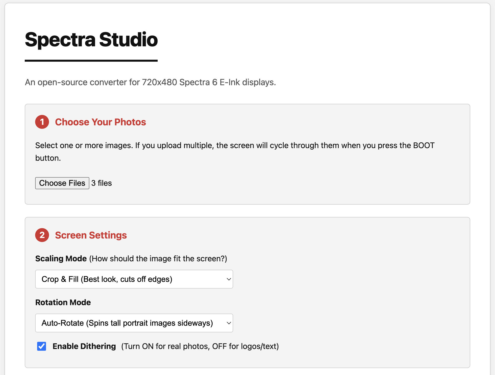
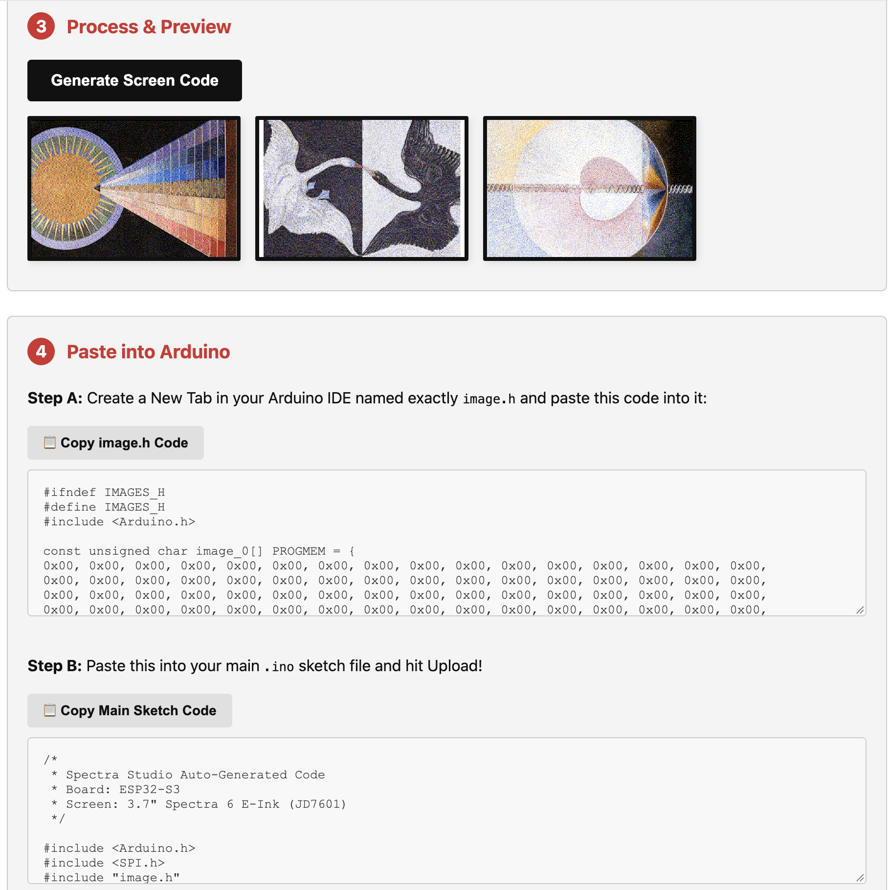

# Spectra 6 Image Conversion Studio

A web-native image processing utility specifically engineered for Spectra 6 E-Paper displays. This tool replaces proprietary, legacy Windows-only vendor software with a secure, cross-platform HTML5 solution.

## Overview

Spectra 6 e-ink hardware requires highly specific color indexing, dithering, and format conversions to display images correctly. Historically, this has required engineers to rely on outdated, OS-locked utilities provided by manufacturers like Good-Display. 

The **Spectra 6 Image Conversion Studio** shifts this entire workflow into the browser. It allows hardware engineers, embedded systems developers, and product teams to easily prepare and optimize imagery for electronic paper displays from any operating system (macOS, Linux, or Windows).

## Enterprise Features

- **Cross-Platform Compatibility:** Operates entirely within modern web browsers, eliminating dependencies on virtualization or legacy Windows environments.
- **Spectra 6 Color Mapping:** Precise algorithmic conversion of standard image formats (PNG, JPG) into the exact multi-color palettes and dithering patterns required by the Spectra 6 hardware architecture.
- **Zero-Install Architecture:** Pure client-side processing ensures complete data privacy and immediate deployment without complex build toolchains or server-side data transmission.
- **Rapid Prototyping:** Accelerates firmware development cycles by providing immediate visual feedback and ready-to-flash image outputs.

## Usage Instructions

1. **Deploy or Run Locally:** Since the studio is entirely client-side, you can open `spectra-converter.html` directly in any modern web browser.
2. **Upload Image:** Select your source graphic (e.g., standard PNG or JPEG).
3. **Configure Settings:** Adjust the dithering and palette options as required for your specific e-paper module.
4. **Export:** Download the optimized output, ready to be flashed to your Spectra 6 display.

## Interface Preview

| Studio Interface | Conversion Preview |
|:---:|:---:|
|  |  |

## Target Hardware
Designed for compatibility with advanced multi-color e-paper displays, including panels analogous to the [Good-Display Spectra 6 series](https://www.good-display.com/product/991.html).

## Contributing

We welcome contributions from embedded developers and frontend engineers. Please submit pull requests to improve dithering algorithms, add support for additional e-paper color profiles, or enhance the user interface.
